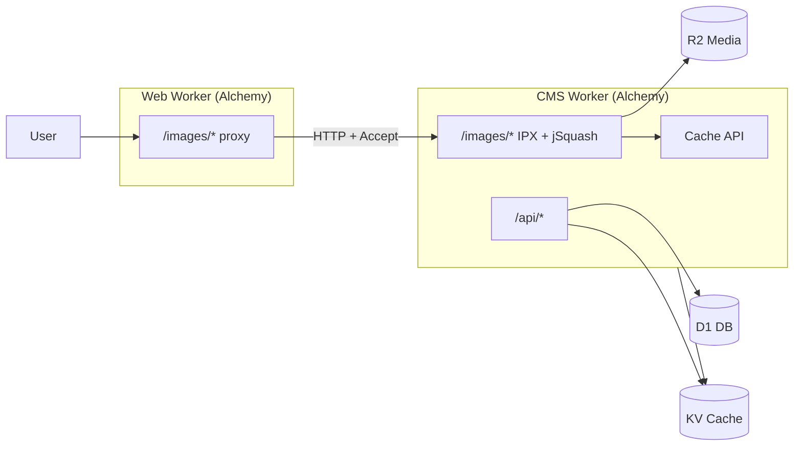

# ADR-006: Image delivery on Cloudflare (jSquash + IPX vs native resizing)

## Status

**Accepted** — jSquash on CMS Worker with IPX URL syntax (2026-07-23)

## Context

Journal du Cuistot serves media from **R2** (`Media` binding) via the **CMS** Nitro app. The **public site** (`apps/web`) does not read R2 directly; it proxies `/images/**` to the CMS. On-demand resizing uses **[IPX](https://github.com/unjs/ipx)-style paths** (`/images/w_800,f_webp/uploads/…`), implemented with **[@jsquash](https://github.com/jamsinclair/jSquash)** in the CMS Worker.

Deployment is defined in **Alchemy v2** ([`alchemy.run.ts`](../../alchemy.run.ts)):

| Resource | Alchemy module | Worker binding | Used for |
|----------|----------------|----------------|----------|
| D1 | `infra/database.ts` | `DB` (CMS), `AI_READY_DB` (web) | Content, ai-ready |
| R2 | `infra/storage.ts` | `Media` (CMS only) | Original + ingest-optimized WebP blobs |
| KV | `infra/storage.ts` | `Cache` (CMS + web env) | Sessions, rate limits, import status |
| Workers | [`infra/workers.ts`](../../infra/workers.ts) | `Cms`, `Web` | SSR + `/images` transform (CMS), public site (web) |

There is **no** Cloudflare Images / `IMAGES` binding in Alchemy today. Web previously referenced `images.binding` in local `wrangler` config; that was removed in favour of a single transform owner on CMS.

Common Cloudflare reference patterns (for comparison):

- [Optimizing image delivery with Image Resizing and R2](https://developers.cloudflare.com/reference-architecture/diagrams/content-delivery/optimizing-image-delivery-with-cloudflare-image-resizing-and-r2/) — edge cache → R2 origin → **`/cdn-cgi/image/…`** transforms
- [Building a free image CDN with R2 and Workers](https://transloadit.com/devtips/creating-a-free-image-cdn-with-cloudflare-r2/) — Worker reads R2, applies **`cf.image`** on the `Response`, query params `w`, `h`, `q`, `f`

We need one transform implementation for **admin UI**, **public web**, and any future API clients, without tying URL generation to a single hostname’s `cdn-cgi` prefix.

## Options compared

### A — Current: jSquash + IPX on CMS Worker (accepted)

```
Browser → web Worker (/images/w_800,f_webp/key)
       → fetch CMS Worker (/images/w_800,f_webp/uploads/…)
       → R2 get → jSquash decode/resize/encode
       → Cache API (pathname key) + Cache-Control: 1y
```

| Criterion | Assessment |
|-----------|------------|
| **Alchemy fit** | Uses existing `Media` + `Cms` Worker only; no new bindings |
| **Multi-client** | Dashboard and web share CMS URLs / IPX modifiers |
| **Nuxt Image** | `localImageSharp` emits IPX ops (`w`, `h`, `f`, `q`, `s`, `fit`, `enlarge`) |
| **Formats** | WebP / JPEG / PNG; `f_avif` → WebP (no AVIF encoder in jSquash) |
| **`f_auto`** | Resolved from `Accept` in app code ([`image-delivery-policy.ts`](../../apps/cms/shared/image-delivery-policy.ts)) |
| **CPU / limits** | Worker WASM per cache miss; mitigated by 2560px cap, op sanitization, 502 on failure |
| **Edge cache** | Long `Cache-Control` + CF proxy on custom domains; Worker `caches.default` for repeat misses |
| **Cost** | R2 + Worker requests; no Images SKU |
| **Ops surface** | Subset of IPX (unsupported modifiers stripped) |

### B — Cloudflare Image Resizing via `cf.image` on R2 `Response` (Transloadit-style)

Worker returns `new Response(r2Body, { cf: { image: { width, height, quality, format, fit } } })`.

| Criterion | Assessment |
|-----------|------------|
| **Alchemy fit** | Still one `Cms` Worker + `Media`; no separate Images binding if using `cf` options on fetch/response (zone-dependent) |
| **URL syntax** | Tutorial uses **query string** (`?w=800&f=webp`), not IPX paths — would need a parser layer or URL rewrite at web |
| **Multi-client** | Possible if all clients hit the same Worker URL shape |
| **Formats** | **AVIF**, **`auto`**, broader Sharp-like behaviour at the platform |
| **CPU** | Less WASM in your Worker; work shifts to CF image stack |
| **Ingest** | Could keep jSquash on upload **or** store originals only and always transform at delivery |
| **Risk** | Two stacks if ingest stays jSquash and delivery uses `cf.image` (visual parity testing) |

### C — `/cdn-cgi/image/…` on the public zone (Cloudflare reference architecture)

Example: `https://www.example.com/cdn-cgi/image/width=80,quality=75/uploads/image.jpg`

| Criterion | Assessment |
|-----------|------------|
| **Alchemy fit** | Requires traffic on a **proxied zone** and path convention; not emitted by Nuxt IPX provider today |
| **Origin** | R2 or CMS as origin behind the zone; CF fetches original on cache miss |
| **Migration** | [Transform Rules](https://developers.cloudflare.com/rules/transform/) can map IPX → `cdn-cgi` if needed later |
| **Multi-client** | Public site fits; **CMS admin on another host** (`admin.…`) needs its own route or still calls CMS `/images` |
| **Coupling** | Strong tie to Cloudflare zone layout; weaker portability |

### D — Hybrid: jSquash ingest + native delivery

| Phase | Tool |
|-------|------|
| Upload / import | jSquash → WebP in R2 (current [`image-optimize-pipeline.ts`](../../apps/cms/shared/image-optimize-pipeline.ts)) |
| `GET /images/…` | `cf.image` or Images binding instead of jSquash |

Reduces duplicate encode logic for **delivery** but splits behaviour and test matrices.

## Side-by-side summary

| | **A jSquash + IPX (now)** | **B `cf.image` Worker** | **C `cdn-cgi/image`** |
|--|---------------------------|-------------------------|------------------------|
| Bindings (Alchemy) | `Media`, `Cache` | `Media`, `Cache` | Zone + origin (R2/CMS) |
| Transform owner | CMS Worker code | CMS Worker + CF | Edge / CF Images |
| URL style | `/images/w_800,f_webp/…` | Usually query or custom | `/cdn-cgi/image/width=80,…/path` |
| Web app role | Proxy + forward `Accept` | Same | Often direct to CDN host |
| AVIF | No (WebP fallback) | Yes | Yes |
| Dashboard thumbs | CMS IPX presets | Same or query API | Same if same host |
| Local dev | libSQL + `.data/media` + jSquash | `cf.image` often **prod-only** | N/A locally |
| Abuse controls | Policy module; **KV rate limit TODO** | Same + platform limits | Platform + WAF |

## Alchemy deployment diagram (accepted architecture)



**Not in diagram:** Web does not bind `Media`. Transforms never run on the web Worker.

## Decision

1. **Keep option A** for production on Alchemy: CMS owns transforms, IPX paths, jSquash, R2 originals.
2. **Web** remains a **proxy** to CMS for `/images/**` (no second transform, no Worker Cache API on web).
3. **Do not** add Cloudflare Images binding to Alchemy until a deliberate migration (option B or D) is chosen and URL compatibility is designed.
4. **Follow-ups** (not blocking ADR):
   - ~~KV **rate limiting** on public `GET /images/**`~~ — implemented (`IMAGE_DELIVERY_RATE_LIMIT` in [`image-delivery-policy.ts`](../../apps/cms/shared/image-delivery-policy.ts), enforced in [`serve-image.ts`](../../apps/cms/server/utils/serve-image.ts)).
   - Optional shared `packages/image-ipx` if `apps/web` should stop importing `apps/cms/shared/ipx-image-path.ts`.
   - Revisit **B** if Worker CPU or AVIF becomes a product requirement.
   - Consider **Workers Caching** (response `Cache-Control` only) instead of or in addition to **Cache API** — see [Workers Cache](https://developers.cloudflare.com/workers/cache/) vs [Cache API limitations](https://developers.cloudflare.com/workers/cache/limitations/).

## Consequences

### Positive

- Single code path for admin and web; aligns with Nuxt Image / IPX ecosystem.
- Alchemy stack stays minimal: no Images product wiring in [`infra/workers.ts`](../../infra/workers.ts).
- Policy layer (max edge, sanitize ops, path guard, transform failure → 502) is explicit in repo.

### Negative

- Higher Worker CPU on cache cold starts than native resizing.
- No true AVIF without changing option or adding a second encoder.
- `cf.image` behaviour in local `nuxt dev` does not mirror production unless mocked.
- **Cache API** (`caches.default`) does not replace zone CDN or **Workers Caching**: the Worker still runs on every request; hits only skip R2/jSquash work inside the handler ([Cache API vs Workers Cache](https://developers.cloudflare.com/workers/cache/limitations/)). Long `Cache-Control` headers enable browser cache and, on proxied routes, can feed **Workers Caching** at the edge when enabled for that Worker.

### When to revisit

- Sustained **CPU/time limits** on CMS Worker image routes in production metrics.
- Requirement for **AVIF** or full IPX modifier parity (rotate, blur, etc.) without maintaining jSquash.
- Desire to serve images **only** from the public zone with **no CMS hop** (then C + Transform Rules or B with a dedicated `cdn.` worker route).

## References

- [Cloudflare: Optimizing image delivery with Image Resizing and R2](https://developers.cloudflare.com/reference-architecture/diagrams/content-delivery/optimizing-image-delivery-with-cloudflare-image-resizing-and-r2/)
- [Transloadit: Free image CDN with R2 and Workers](https://transloadit.com/devtips/creating-a-free-image-cdn-with-cloudflare-r2/)
- [unjs/ipx](https://github.com/unjs/ipx) — URL modifier conventions
- [jSquash Cloudflare Worker example](https://github.com/jamsinclair/jSquash/tree/main/examples/cloudflare-worker-esm-format)
- Implementation: [`apps/cms/server/utils/serve-image.ts`](../../apps/cms/server/utils/serve-image.ts), [`apps/cms/shared/image-delivery-policy.ts`](../../apps/cms/shared/image-delivery-policy.ts), [`apps/web/server/utils/serve-cms-image.ts`](../../apps/web/server/utils/serve-cms-image.ts)
